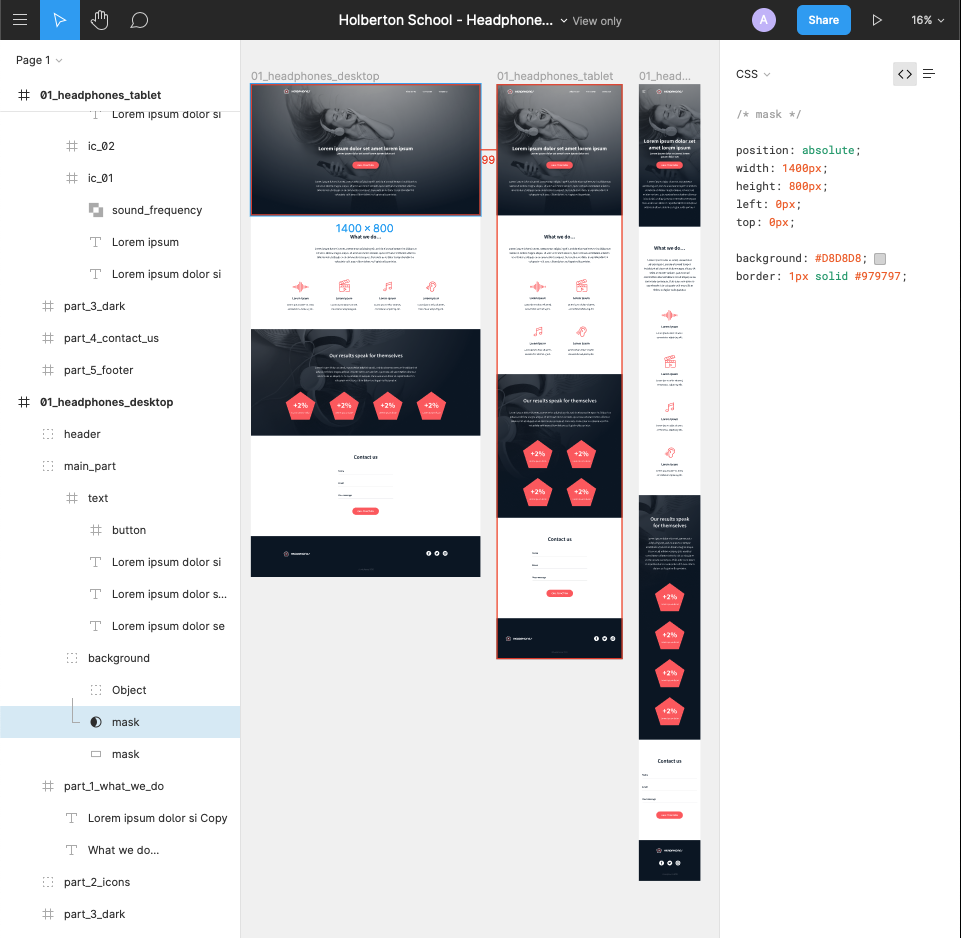
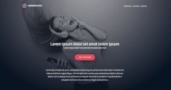

# Implement a design from scratch

In this project, you will implement from scratch, without any library, a web page. We will use all HTML/CSS/Accessibility/Responsive design knowledges that you have learned previously.

We won’t have a lot of instruction, you are free to implement it the way that you want - the objective is simple: Have a fully functional web page that looks the same as the designer file.

Here is the design of the page that you get in Figma:

Building a web page the right way, is not easy - expect if you put in place strong foundations:

* reset CSS styling
* use variables
* simple/“as generic as you can” CSS selectors
* avoid as more as you can super specific CSS selector
* simple HTML structure -  `div`  containers are your friend!

Last advice: I always start to build a web page from outside to inside and from top to bottom.

## Now, your turn!

1. For this first task: **create the header/hero piece**
2. For this second task:  **create the “What we do…” section**
In this section, you will need custom font icons. 
**Important:**  try to build as generic as you can… you will probably need some components in next section.
3. For this third task:  **create the “Our results” section**
Now you can reuse components form the previous task!
4. A good landing page has always a contact form.
We are free to add any animations and/or constraints on fields.
5. Last piece of the page… the Footer!

### When you are done, here is the result

### And the mobile version shoukd look like this one)

And you are done!
..*Not really - there are some advanced tasks so I will inform you of any developments/progress..*
