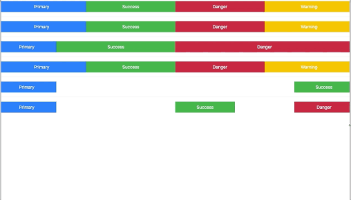
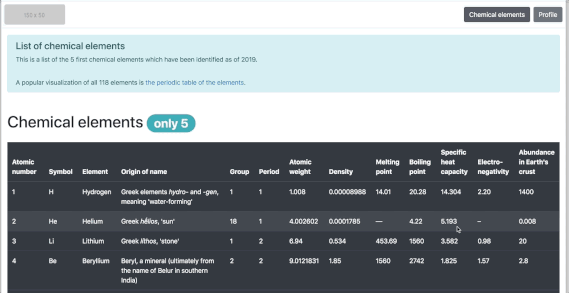
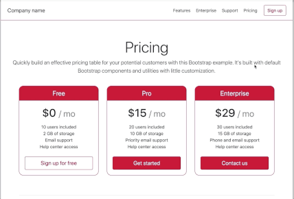
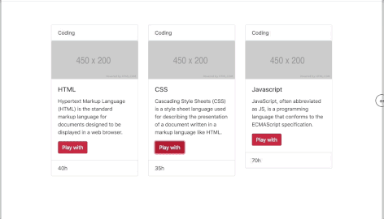

# Bootstrap

https://getbootstrap.com

**Bootstrap** is a free and open-source *CSS* framework directed at responsive, mobile-first front-end web development. It contains *CSS* and *JavaScript* design templates for typography, forms, buttons, navigation, and other interface components.

For this project, you will use **Bootstrap 4.4** and only the *CSS styling part*.

## General

* Usage of Containers
* Usage of the Grid system
* Usage of Components
* Usage of Utilities
  
### Tasks

#### *Build this responsive web page using Bootstrap Grid system:*

#### *Design a table of chemical elements:*

#### *Learn how to use cards:*

#### *How to create the custom stylesheet to match exsisted bootstrap layout:*

#### *and many more...*
